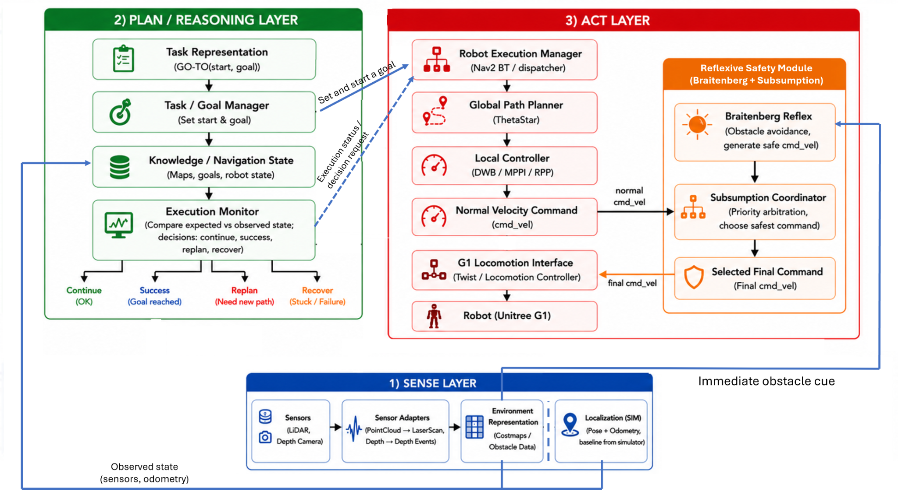
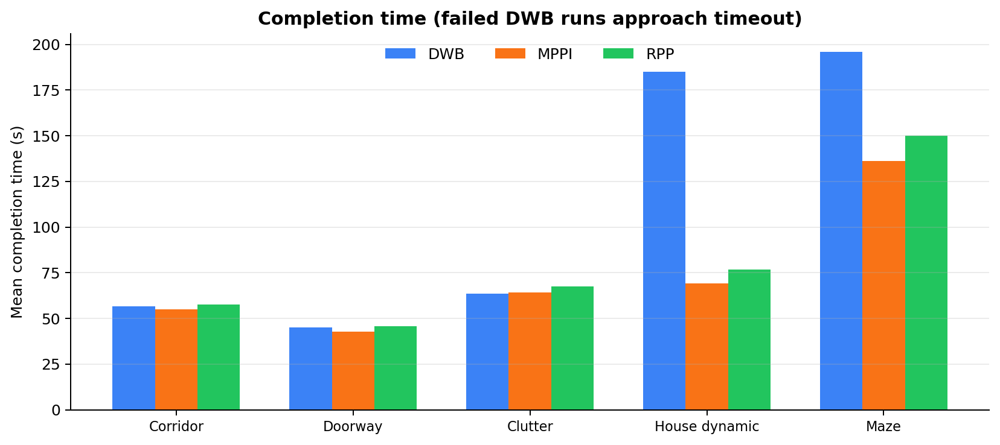

# Unitree G1 A-to-B Navigation Benchmark

A standalone indoor navigation benchmark for the **Unitree G1 EDU** robot in **Gazebo**, built with **ROS 2 Humble**, **Nav2**, and **RViz2**.

The project compares three Nav2 local planner/controller profiles - **DWB**, **MPPI**, and **Regulated Pure Pursuit (RPP)** - under identical indoor benchmark conditions. A common **ThetaStar** global planner is used in all runs. The system also includes execution monitoring, Nav2 recovery, CSV telemetry, automated result aggregation, and a hard-wired **Braitenberg-inspired safety reflex** with subsumption-based command arbitration.

> **Full project report:** [COGAR G1 Navigation Project Report](docs/COGAR_G1_Navigation_Project_Report.pdf)

The project compares three Nav2 local planners—**DWB**, **MPPI**, and **RPP**—while keeping the same known maps, start/goal poses, robot footprint, costmaps, limits, and **ThetaStar** global planner.

## Project Overview

- **Robot:** Unitree G1 EDU abstraction, 29 DOF
- **Sensors:** Livox MID-360-style LiDAR and Intel RealSense D435i-style depth camera
- **Localization:** simulator-provided baseline localization
- **Global planner:** ThetaStar
- **Local planners:** DWB, MPPI, RPP
- **Scenarios:** corridor, doorway, clutter, house dynamic, and maze
- **Evaluation:** success rate, completion time, path efficiency, final goal error, recovery count, clearance, and collision-proxy events

The architecture combines hierarchical navigation with execution monitoring, Nav2 recovery, and a Braitenberg-inspired reflexive safety behavior.

<p align="center">
  
</p>

## Workspace Structure

<p align="center">
  
</p>

```text
ros2_ws/
├── build/
├── install/
├── log/
├── results_corridor/
├── results_doorway/
├── results_clutter/
├── results_house_dynamic/
├── results_maze/
└── src/
    ├── g1_cogar_nav_benchmark/
    ├── g1_description_ros2/
    └── g1_gazebo/
```

## Benchmark Scenarios

<p align="center">
  
</p>

| Scenario | Main purpose |
|---|---|
| `corridor` | Straight open navigation and baseline timing |
| `doorway` | Narrow-passage alignment |
| `clutter` | Static obstacle adaptation |
| `house_dynamic` | Dynamic route blockage and rerouting |
| `maze` | Sharp turns and constrained geometry |

## Build and Source the Workspace

```bash
cd ~/ros2_ws
source /opt/ros/humble/setup.bash
colcon build --symlink-install
source install/setup.bash
```

Run the two `source` commands again in every new terminal.

## Run the Project

### Automatic Run

This mode launches the selected scenario and planner, sends the configured goal automatically, and stores the run output in the selected result directory.

```bash
cd ~/ros2_ws
source /opt/ros/humble/setup.bash
source install/setup.bash

USE_GAZEBO_GUI=true \
USE_RVIZ=true \
STARTUP_WAIT=60 \
GOAL_TIMEOUT=265 \
bash src/g1_cogar_nav_benchmark/scripts/run_one.sh \
  corridor \
  rpp \
  results_video/corridor_rpp_demo
```

General form:

```bash
bash src/g1_cogar_nav_benchmark/scripts/run_one.sh \
  <scenario_id> \
  <planner_id> \
  <output_directory>
```

Available planner IDs used in the report:

```text
dwb
mppi
rpp
```

### Manual Goal Selection in RViz

This mode starts Gazebo, Nav2, and RViz without sending the goal automatically.

```bash
cd ~/ros2_ws
source /opt/ros/humble/setup.bash
source install/setup.bash

ros2 launch g1_cogar_nav_benchmark k3_nav_bringup.launch.py \
  scenario_id:=house_dynamic \
  planner_id:=dwb \
  use_rviz:=true \
  use_gazebo_gui:=true \
  logger_output_file:=$PWD/manual_house_dynamic_log.csv
```

After startup, use **Nav2 Goal** in RViz to select the destination pose manually.

## Main Results

The benchmark contained **45 runs**: five scenarios, three planners, and three repetitions.

<p align="center">
  
</p>

<p align="center">
  
</p>

| Planner | Overall success | Main finding |
|---|---:|---|
| DWB | 60% | Useful baseline, but lost progress in the two hardest scenarios |
| MPPI | 100% | Best overall combination of reliability, time, and goal accuracy |
| RPP | 100% | Reliable and conservative, but generally slower and slightly less precise |

In `house_dynamic`, the Braitenberg-inspired reflex provided an immediate safety response to the suddenly appearing obstacle. ThetaStar replanning and the local planner then handled the alternative route. Nav2 recovery was evaluated separately when normal navigation lost progress.

## Limitations

- The evaluation is simulation-only.
- Localization is provided by the simulator baseline.
- Each planner/scenario pair was repeated three times.
- The humanoid locomotion model is simplified; realistic motion for a 29-DOF humanoid would require whole-body dynamics, gait generation, balance control, and greater computational resources.

## Author

**Mahdi Baghban Ghalehchi**  
Cognitive Architectures for Robotics — COGAR K3 Project  
University of Genoa, DIBRIS
