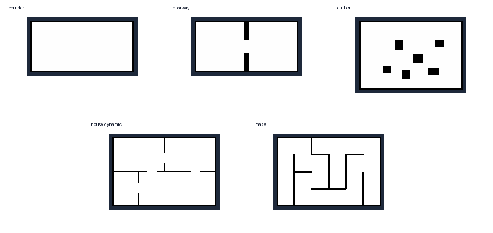
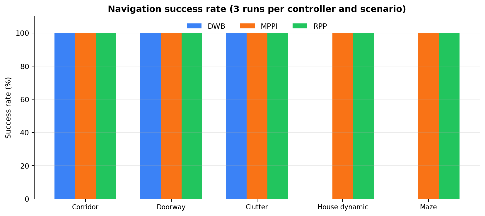
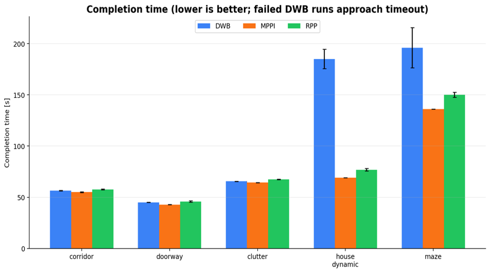

# Unitree G1 A-to-B Navigation Benchmark

A standalone indoor navigation benchmark for the **Unitree G1 EDU** robot in **Gazebo**, developed with **ROS 2 Humble**, **Nav2**, and **RViz2**.

The project compares three Nav2 local planners—**DWB**, **MPPI**, and **Regulated Pure Pursuit (RPP)**—under identical indoor benchmark conditions. A common **ThetaStar** global planner is used in every run. The system also includes execution monitoring, Nav2 recovery, CSV telemetry, automated result aggregation, and a hard-wired **Braitenberg-inspired safety reflex** with subsumption-based command arbitration.

> **Full project report:** [COGAR G1 Navigation Project Report](Report%20and%20Simulation%20Videos/COGAR_G1_Navigation_Project_Report.pdf)

## Project Overview

- **Robot:** Unitree G1 EDU abstraction, 29 DOF
- **Sensors:** Livox MID-360-style LiDAR and Intel RealSense D435i-style depth camera
- **Localization:** Simulator-provided baseline localization
- **Global planner:** ThetaStar
- **Local planners:** DWB, MPPI, and RPP
- **Scenarios:** Corridor, doorway, clutter, house dynamic, and maze
- **Evaluation:** Success rate, completion time, path efficiency, final goal error, recovery count, clearance, and collision-proxy events

The architecture combines hierarchical navigation with execution monitoring, Nav2 recovery, and a Braitenberg-inspired reflexive safety behavior.

<p align="center">
  
</p>

## Workspace Structure


```text
ros2_ws/
├── results_corridor/
├── results_doorway/
├── results_clutter/
├── results_house_dynamic/
├── results_maze/
└── src/
    ├── g1_cogar_nav_benchmark/
    ├── g1_description_ros2/
    └── g1_gazebo/
```

## Benchmark Scenarios

<p align="center">
  
</p>

| Scenario | Main purpose |
|---|---|
| `corridor` | Straight open navigation and baseline timing |
| `doorway` | Narrow-passage alignment |
| `clutter` | Static obstacle adaptation |
| `house_dynamic` | Dynamic route blockage and rerouting |
| `maze` | Sharp turns and constrained geometry |

## Dependencies

The project requires:

- ROS 2 Humble
- Gazebo Classic with `gazebo_ros_pkgs`
- Nav2 and `nav2_bringup`
- RViz2
- Python 3
- Colcon
- Rosdep

Install the main packages:

```bash
sudo apt update
sudo apt install -y \
  ros-humble-desktop \
  ros-humble-navigation2 \
  ros-humble-nav2-bringup \
  ros-humble-gazebo-ros-pkgs \
  python3-colcon-common-extensions \
  python3-rosdep
```

If `rosdep` has not been initialized before:

```bash
sudo rosdep init
rosdep update
```

Install the remaining dependencies declared by the workspace packages:

```bash
cd ~/ros2_ws
source /opt/ros/humble/setup.bash
rosdep install --from-paths src --ignore-src -r -y
```

## Build and Source the Workspace

```bash
cd ~/ros2_ws
source /opt/ros/humble/setup.bash
colcon build --symlink-install
source install/setup.bash
```

Run the two `source` commands again in every new terminal:

```bash
source /opt/ros/humble/setup.bash
source ~/ros2_ws/install/setup.bash
```

## Reset Before a New Run

Gazebo or Nav2 processes can remain active after an interrupted experiment. The following reset procedure was used before starting a clean benchmark run.

> **Warning:** This block terminates running Gazebo and ROS 2 processes. Do not run it while another ROS 2 experiment is active.

```bash
cd ~/ros2_ws

pkill -9 -f gzserver 2>/dev/null || true
pkill -9 -f gzclient 2>/dev/null || true
pkill -9 -f gazebo 2>/dev/null || true
pkill -9 -f rviz2 2>/dev/null || true
pkill -9 -f ros2 2>/dev/null || true
pkill -9 -f benchmark_runner 2>/dev/null || true
pkill -9 -f benchmark_logger 2>/dev/null || true
pkill -9 -f house_dynamic_obstacle_commander 2>/dev/null || true
pkill -9 -f k3_nav_bringup.launch.py 2>/dev/null || true
pkill -9 -f controller_server 2>/dev/null || true
pkill -9 -f planner_server 2>/dev/null || true
pkill -9 -f bt_navigator 2>/dev/null || true
pkill -9 -f behavior_server 2>/dev/null || true
pkill -9 -f lifecycle_manager 2>/dev/null || true
pkill -9 -f map_server 2>/dev/null || true
pkill -9 -f robot_state_publisher 2>/dev/null || true
pkill -9 -f spawn_entity.py 2>/dev/null || true

rm -rf /tmp/gazebo-* 2>/dev/null || true
rm -rf /tmp/ignition-* 2>/dev/null || true
rm -rf /tmp/ros2_* 2>/dev/null || true
rm -f /dev/shm/fastrtps_* 2>/dev/null || true

ros2 daemon stop 2>/dev/null || true
sleep 3
ros2 daemon start 2>/dev/null || true
sleep 3
```

After the reset:

```bash
source /opt/ros/humble/setup.bash
source ~/ros2_ws/install/setup.bash
```

## Run the Project

### Automatic Run

This mode launches the selected scenario and planner, sends the configured goal automatically, and stores the output in the selected result directory.

```bash
cd ~/ros2_ws
source /opt/ros/humble/setup.bash
source install/setup.bash

USE_GAZEBO_GUI=true \
USE_RVIZ=true \
STARTUP_WAIT=60 \
GOAL_TIMEOUT=265 \
bash src/g1_cogar_nav_benchmark/scripts/run_one.sh \
  corridor \
  rpp \
  results_video/corridor_rpp_demo
```

General form:

```bash
bash src/g1_cogar_nav_benchmark/scripts/run_one.sh \
  <scenario_id> \
  <planner_id> \
  <output_directory>
```

Available scenario IDs:

```text
corridor
doorway
clutter
house_dynamic
maze
```

Available planner IDs:

```text
dwb
mppi
rpp
```

### Manual Goal Selection in RViz

This mode starts Gazebo, Nav2, and RViz without sending the goal automatically.

```bash
cd ~/ros2_ws
source /opt/ros/humble/setup.bash
source install/setup.bash

ros2 launch g1_cogar_nav_benchmark k3_nav_bringup.launch.py \
  scenario_id:=house_dynamic \
  planner_id:=dwb \
  use_rviz:=true \
  use_gazebo_gui:=true \
  logger_output_file:=$PWD/manual_house_dynamic_log.csv
```

After startup, use **Nav2 Goal** in RViz to select the destination pose manually.

## Main Results

The benchmark contained **45 runs**: five scenarios, three planners, and three repetitions.

<p align="center">
  
</p>

<p align="center">
  
</p>

| Planner | Overall success | Main finding |
|---|---:|---|
| DWB | 60% | Useful baseline, but lost progress in the two hardest scenarios |
| MPPI | 100% | Best overall combination of reliability, time, and goal accuracy |
| RPP | 100% | Reliable and conservative, but generally slower and slightly less precise |

In `house_dynamic`, the Braitenberg-inspired reflex provided an immediate safety response to the suddenly appearing obstacle. ThetaStar replanning and the local planner then handled the alternative route. Nav2 recovery was evaluated separately when normal navigation lost progress.

## Limitations

- The evaluation is simulation-only.
- Localization is provided by the simulator baseline.
- Each planner/scenario pair was repeated three times.
- The humanoid locomotion model is simplified. Realistic motion for a 29-DOF humanoid would require whole-body dynamics, gait generation, balance control, and greater computational resources.

## Author

**Mahdi Baghban Ghalehchi**  
Cognitive Architectures for Robotics — COGAR K3 Project  

